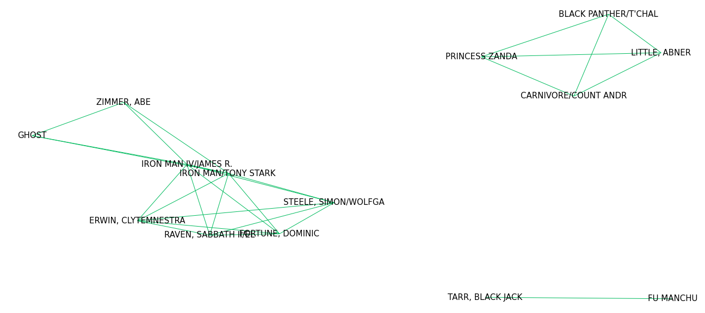
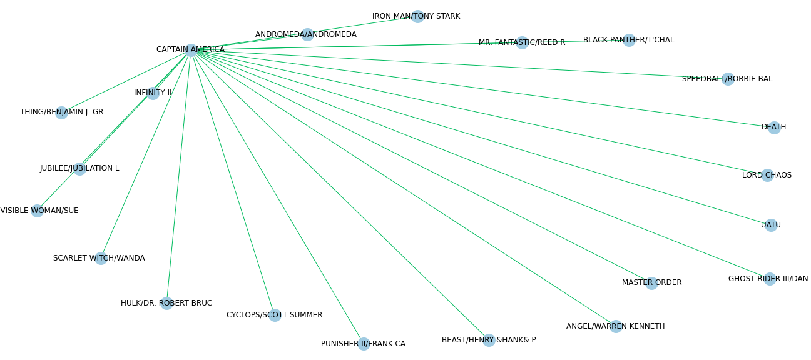

# Portfolio

Tableau Public: [https://public.tableau.com/profile/jia.jian.woo#!/](https://public.tableau.com/profile/jia.jian.woo#!/)

## [KLSE Closing Price Prediction and Anomaly Detection Using Deep Learning (Python)](https://github.com/jiajianwoo/LSTM-KLSI/blob/main/LSTM%20KLSE.ipynb)
* An RNN model based on LSTM was trained to predict KLSI daily closing price, using closing prices of previous 14 days.

* **Actual vs. predicted closing price.**

* Mean squared error is 1356.03. The model can capture and predict trends of the closing price quite accurately.

* **Another model based on LSTM autoencoder was also trained to detect closing price anomalies.**

* Red points denote anomalies. In general, the model treats abnormally high closing prices and abrupt changes as anomalies.

## [Identifying Quora Question Pairs That Have The Same Intent (Python)](https://github.com/jiajianwoo/quora-question/blob/main/QuoraQuestionPairs.ipynb)

* Dataset from Kaggle: [https://www.kaggle.com/c/quora-question-pairs/overview](https://www.kaggle.com/c/quora-question-pairs/overview)

* The challenge was, given a pair of Quora questions, identify if they are asking the same question.

* A Siamese network with LSTM units was built for this NLP problem. The model uses GloVe embedding.

## [Predicting Telco Customer Churn with a Bayesian approach (R)](https://rpubs.com/jiajianwoo95/719552)

* Dataset from Kaggle: https://www.kaggle.com/blastchar/telco-customer-churn

* A Bayesian logistic regression model was fit using rstanarm package in R.

* **MCMC traceplots for some of the parameters (coefficients of logistic regression)**

* **Posterior distribution of the churn probabilities for each customer in the train set**

* **Average churn probability for each customer in the train set**

* **The model was also used to predict churn rates for customers in a test set.**

## [Clustering Analysis on Pokemon Based On Their Stats (R)](https://rpubs.com/jiajianwoo95/717484)

* Clustering analysis was performed on all 606 fully-evolved Pokemon from Generation 1-8, based on their stats. This would enable better-informed decisions on which Pokemon to choose to form a well-balanced team made up of 6 Pokemon. More info on Pokemon stats can be found here: [https://www.ign.com/wikis/pokemon-x-y/Base_Stats_and_Battle_Stats](https://www.ign.com/wikis/pokemon-x-y/Base_Stats_and_Battle_Stats).

* The clustering analysis was based on 4 clusters. Pokemon can generally be classified into 1 of these 4 clusters, based on their stats: offensive, defensive, all-rounder, specially defensive.

* **Plot below shows clusters being visualised using 2 principal components that captured 50% of the variance.**

## [Analysing and Predicting Marvel Comic Character Network (Python)](https://github.com/jiajianwoo/marvel_network/blob/main/Marvel%20character%20network.ipynb)
* Data containing network of characters who have appeared together was obtained from [http://syntagmatic.github.io/exposedata/marvel/](http://syntagmatic.github.io/exposedata/marvel/)

* **A small subset of the graph.**

* **Distribution of number of characters each character has appeared together with.**

The network seems to be not random and is likely to form following a preferential attachment process where a more highly connected node is more likely to get even more connections.

The character with the highest degree (character who has appeared with other characters the most time) is Captain America. This is a subset of the Captain America subset of the graph:

A logistic regression and a neural network model was also built to try to predict new edge formation. This can tell us, for new characters, which character they will most likely to appear together with.

## [Analysing and Predicting Customer Churn in Telcom (Python)](https://github.com/jiajianwoo/telco_churn/blob/main/telco%20churn.ipynb)
* Dataset from Kaggle: https://www.kaggle.com/blastchar/telco-customer-churn

All analysis was based only on this dataset. It seems that churn rate was lower among customers who subscribed for extra services like streaming TV, streaming movies, online backup, online security, tech support etc. Higher churn rate was also observed for newer customers, customers who paid monthly (instead of paying annually), senior citizens and customers with no partners/dependents.

* **Churn rate is the highest among new customers (<3 months).**

* **ROC curve of the logistic regression model built**

## [Analysing Tripadvisor Reviews (Python)](https://github.com/jiajianwoo/Analysing-museum-reviews-on-Tripadvisor/blob/main/BM%20reviews.ipynb)
* Web scraped British Museum reviews from Tripadvisor
* Performed sentiment analysis
* Performed topic modelling to gain insights on visitor reviews

* **Distribution of positive and negative reviews:**

* **Word cloud representing the words used in positive reviews left by visitors:**

* **Word cloud representing the words used in negative reviews left by visitors:**

* **Upon topic modelling on positive reviews, the following are the words used in each of two topics:**

Positive reviews of the museum were mainly about 2 topics: its temporary exhibitions (one of which is the Troy exhibition) and its permanent exhibitions.

The collections displayed in the permanent collection, e.g. items in the Egyptian gallery and the Rosetta Stone were mentioned frequently in the positive reviews, as well as the fact that its entrance is free of charge.

* **Words used in negative reviews:**

Looking at the topic modelling results, it seems like the negative reviews revolved around only one topic. The negative reviews were mostly about the exhibitions and the crowds. The imperialist controversies around British Museum, primarily its acquisition of items of like the Elgin Marbles and the Rosetta Stone were not mentioned as frequently in the reviews.

To improve visitor experience, the museum can work on improving how the exhibitions are organised and crowd management.

## [Analysing Booking.com Reviews (Python)](https://github.com/jiajianwoo/text-mining-hotel/blob/main/Booking%20text%20mining-2.ipynb)
* Web scraped reviews of a hotel in Kuala Lumpur from Booking.com
* Performed sentiment analysis
* Performed topic modelling to gain insights on guest reviews to explore issues that can be addressed to improve guest satisfaction

* **Distribution of positive and negative reviews:**

* **Word cloud representing the words used in positive reviews left by guests:**

* **Word cloud representing the words used in negative reviews left by guests:**

* **Words used in negative reviews:**

This should give the hotel's management some insights on what their guests were mostly unsatisfied about: parking, staff, breakfast and room condition/cleanliness. The management should still look at the detail reviews to see exactly what improvements are needed.

## [Predicting Cancellation of Hotel Reservations (R)](https://rpubs.com/jiajianwoo95/706496)
* Analysed guest visits at a city hotel and a resort
* Analysed reservation cancellation behaviour
* Built a model to predict whether guests would cancel their reservations

Significant proportion of guests cancelled their hotel reservations.

People from some countries are more likely to cancel their reservations compared to other countries.

The above graph compares the predictions made by the model on the number of cancellations every day with the actual number.

